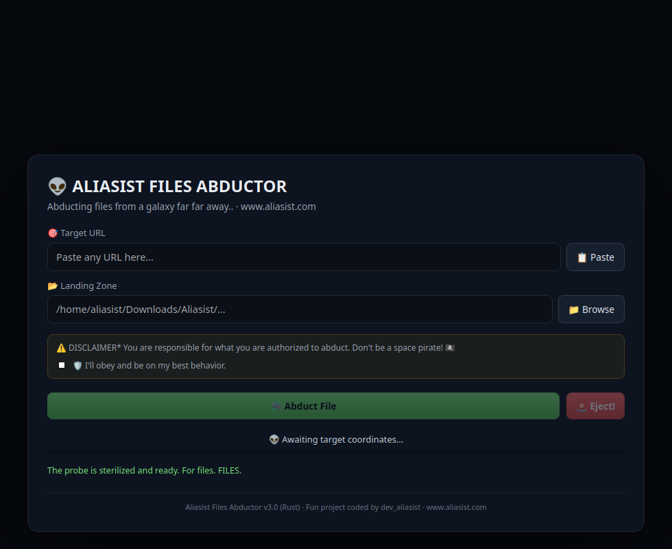

# Aliasist Files Abductor (Rust)

A ground-up rewrite of [Aliasist Files Abductor](https://github.com/aliasist/files-abductor)
in Rust + Tauri — same alien-abduction theme and jokes, new engine.



- YouTube & direct URL downloads via `yt-dlp`, run through Tokio so progress
  parsing never blocks the UI
- Cinematic splash sequence (GSAP timeline: UFO descends, beam charges, cow
  gets abducted)
- Progress bar and joke rotation animated with Framer Motion
- Single binary, no Node/Electron runtime bundled — Tauri wraps the OS's
  native webview instead

## Why the rewrite

The original app is Electron. This one keeps the exact same UX (same jokes,
same disclaimer, same alien theme) but moves the download engine and process
management to Rust:

- `Result<T, E>` forces every yt-dlp failure path to be handled explicitly
  instead of an unhandled promise rejection
- Cancellation ("Eject") kills the child process through a `Mutex`-guarded
  handle instead of a global `abortRequested` boolean
- Release builds are stripped + LTO'd — tens of MB instead of Electron's
  100+ MB bundle

## Requirements

- [Rust](https://rustup.rs/) (stable)
- [Node.js](https://nodejs.org/) 18+ (frontend build only — not bundled into
  the final binary)
- [`yt-dlp`](https://github.com/yt-dlp/yt-dlp) on `PATH`

## Development

```bash
npm install
npm run tauri dev
```

## Building a release

```bash
npm run tauri build
```

Produces a platform-native bundle (AppImage/deb on Linux, .exe/.msi on
Windows, .app/.dmg on macOS) in `src-tauri/target/release/bundle/`.

## Architecture

```
src-tauri/src/
  lib.rs         — Tauri commands (get_dl_dir, download_file, abort_download)
  downloader.rs  — spawns yt-dlp, parses --newline progress output,
                   emits download://progress events to the frontend

src/
  App.tsx              — main UI: URL input, save picker, progress, jokes
  components/Splash.tsx — GSAP-driven cinematic intro
  jokes.ts             — the joke banks (ported + extended from the
                          original Electron app)
  style.css            — alien theme (dark, green/blue accents)
```

## License

[Unlicense](./LICENSE) — public domain. Use it, fork it, sell it, whatever.

## Contact

[aliasist.com](https://www.aliasist.com) · dev@aliasist.com
